# Data Export from the MyTourBook Derby database

## Tools Used

Basically every tool being able to generate a JSON export of a SQL query result can be used. Using the limited Derby DB CLI "IJ" is somehow possible but post processing the query result would be needed.

### DBeaver

Since [DBeaver](https://dbeaver.io/) is, similar to MyTourBook based on the Eclipse Framework, it might be the first choice.  
If you are happy in using DBeaver (or it's Eclipse pluing), or (untested!) Squirrel or IntelliJ's database plugin or anything else, you may skip the next subsection.

### IJ

Before discovering DBeaver's Derby support, the first experiments where made using the Derby CLI tool. Also in the hope to script the export. The rudimentary nature of IJ made me switch to DBeaver for now.  
The findings discovered along the way are included here just for the sake of completeness and to possibly pick them up later. Especially to find out how to query the data from the tables was not easy. Finding out about `SET SCHEMA "USER";` was the break through moment.

```bash
cd mytourbook_db
java -Dij.protocol=jdbc:derby: -Dij.database=tourbook -jar /opt/db-derby-10.16.1.1-bin/lib/derbyrun.jar ij

|   ij version 10.16
|   CONNECTION0* -  jdbc:derby:tourbook
|   * = current connection
"https://db.apache.org/derby/docs/10.7/tools/ttoolsij30600.html#ttoolsij30600"

java -Dij.protocol=jdbc:derby: -Dij.database=tourbook -jar /opt/db-derby-10.16.1.1-bin/lib/derbyrun.jar xport.sql > exported.txt
"https://db.apache.org/derby/docs/10.0/manuals/tools/tools25.html"
```

```sql
CONNECT 'jdbc:derby:tourbook';
SHOW TABLES IN USER;
DESCRIBE USER.TOURDATA;
SELECT * FROM TOURDATA;
SET SCHEMA "USER";
SELECT * FROM TOURDATA
SELECT * FROM TOURBIKE;
```

## Extracting the Data using DBeaver

### Setup

First of all, you should make a copy of MyTourBook's Derby database. When running Linux, it probably will by located at `~/.mytourbook/derby-database`.

```bash
mkdir -p ~/projects/DerbyDB
cd ~/projects/DerbyDB
cp -ra ~moppel/.mytourbook/derby-database .
```

The DBeaver is started for the first time, it will present you with a dialog for setting up a new connection. Search for and choose the Derby Embedded type:
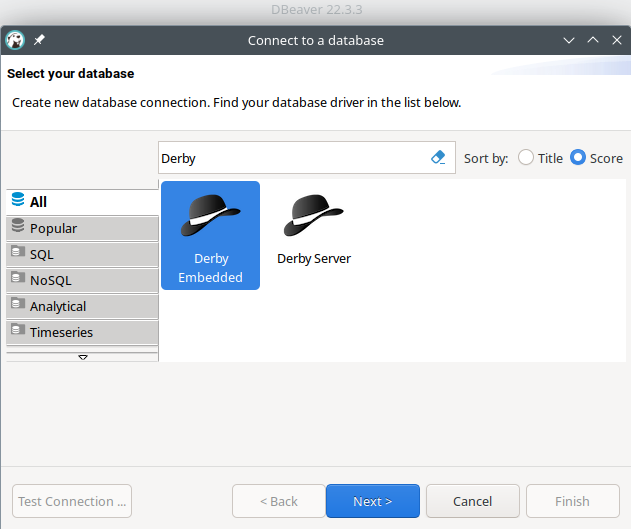

Next, choose the base path of the database backup from above:
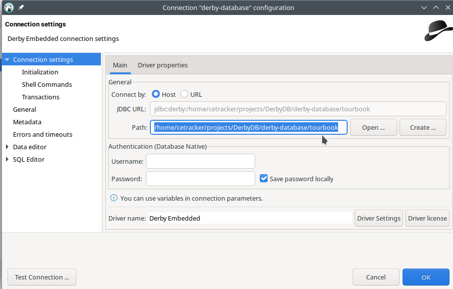

On first opening the DB connection, DBeaver will search for and offering the needed database drivers for download:
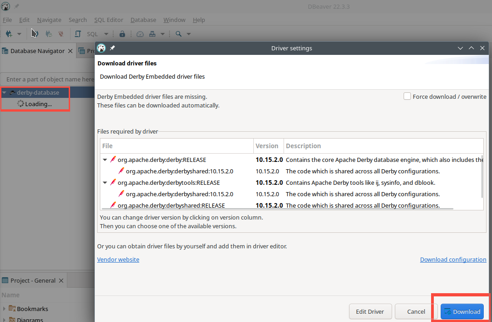

Once the database was successfully connected to, RMB (right mouse button) click on the connectin name and open a new SQL editor (shortcut: `[F3]`).
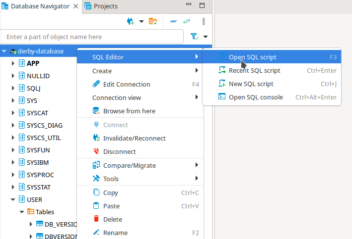

Finally, you may run any SQL query to discover the database's content. The query to extract the needed data for the CETracker, however is the one below:
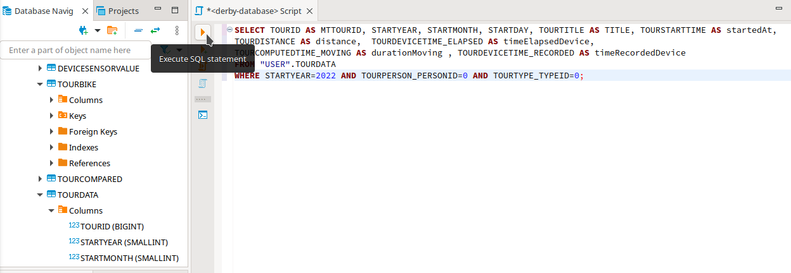

```sql
SELECT TOURID AS MTTOURID, STARTYEAR, STARTMONTH, STARTDAY, TOURTITLE AS TITLE, TOURSTARTTIME AS STARTTIMESTAMP,
TOURDISTANCE AS distance, TOURALTUP, TOURALTDOWN, TOURDEVICETIME_ELAPSED AS timeElapsedDevice,
TOURCOMPUTEDTIME_MOVING AS durationMoving , TOURDEVICETIME_RECORDED AS timeRecordedDevice
FROM "USER".TOURDATA
WHERE STARTYEAR=2022 AND TOURPERSON_PERSONID=0 AND TOURTYPE_TYPEID=0;
```

Obvioulsy, you need to adjust the `WHERE` clause of the query above to meet your data.

Once you have veryfied the query result to be feasable:
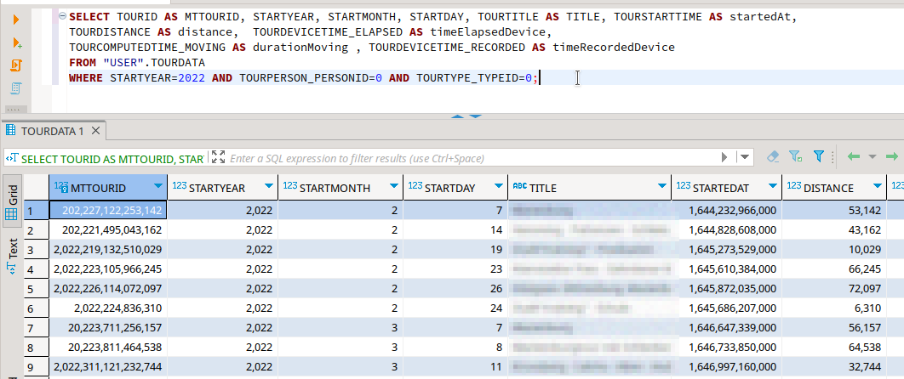

You may now finally export the data via RMB click on any result value, choosing export:
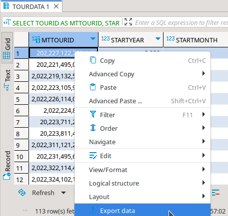
exporting it to a JSON file
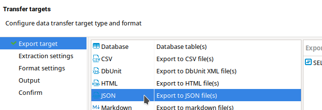
confirming all the suggested defaults except within "Format settings"
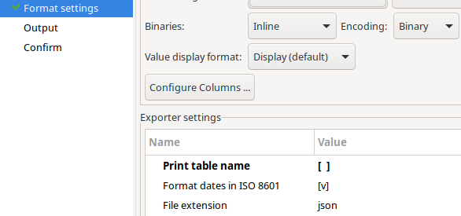
where you should desect "Print table name" and inside "Output"
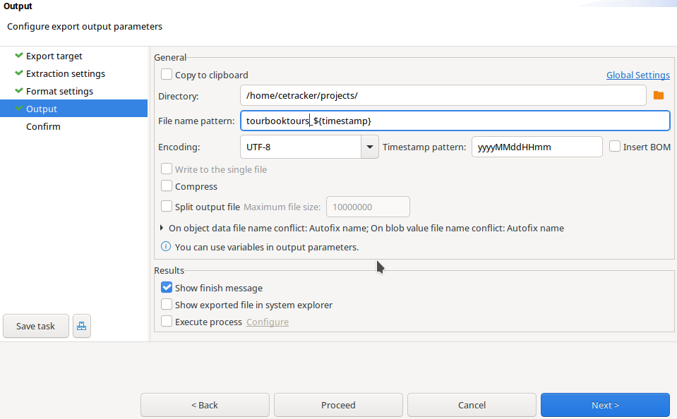
where you may change the output folder to your liking.

After a final click on "Proceed" a file with the choosen name will be generated. It's content should look similar to this:

```json
[
  {
    "MTTOURID": 202227122253142,
    "STARTYEAR": 2022,
    "STARTMONTH": 2,
    "STARTDAY": 7,
    "TITLE": "Tour 1",
    "STARTTIMESTAMP": 1644232966000,
    "DISTANCE": 53142,
    "TOURALTUP": 593,
    "TOURALTDOWN": 592,
    "TIMEELAPSEDDEVICE": 8652,
    "DURATIONMOVING": 7614,
    "TIMERECORDEDDEVICE": 7624
  },
  {
    "MTTOURID": 202221495043162,
    "STARTYEAR": 2022,
    "STARTMONTH": 2,
    "STARTDAY": 14,
    "TITLE": "Tour 2",
    "STARTTIMESTAMP": 1644828608000,
    "DISTANCE": 43162,
    "TOURALTUP": 203,
    "TOURALTDOWN": 204,
    "TIMEELAPSEDDEVICE": 5757,
    "DURATIONMOVING": 5534,
    "TIMERECORDEDDEVICE": 5544
  }
]
```

Voilà, you should now have successfully exported the data, ready for importing it to CETracker.
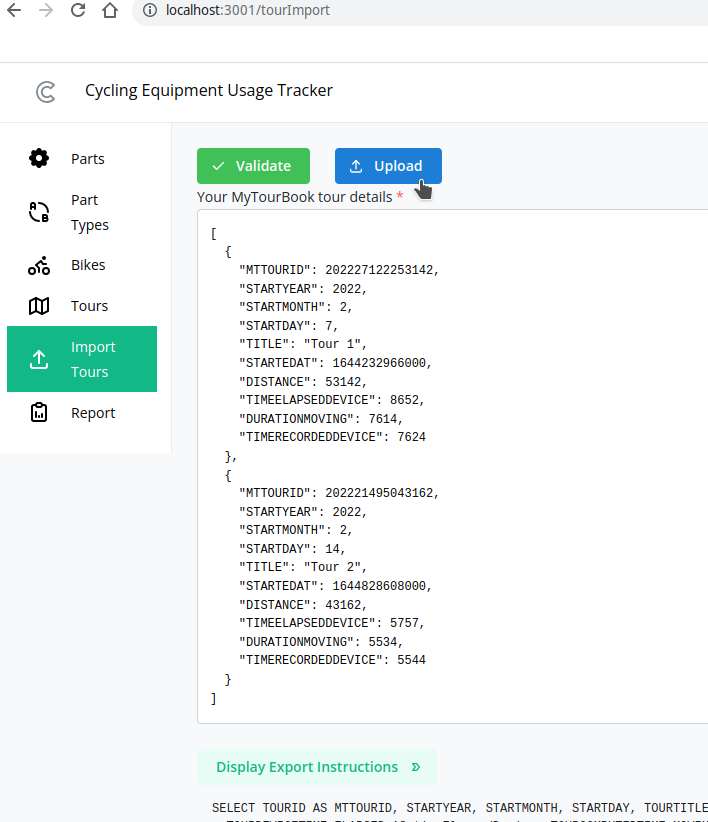

This needs to be repeated for every new imported tour to MyTourBook.
