# Getting Started

This is a step-by-step guide for the initial setup of CETracker — from an empty installation to your first usage report.
All screenshots show the built-in demo data, so your instance will look emptier at first.

## Run CETracker

The recommended way to run CETracker is via [cetracker-compose](https://github.com/cetracker/cetracker-compose):

```bash
git clone https://github.com/cetracker/cetracker-compose.git
cd cetracker-compose
docker compose up -d
```

Podman works as well. Allow the database a moment to start up, then open [http://localhost](http://localhost).

If you'd like to explore CETracker with sample data first, set `SPRING_PROFILES_ACTIVE: demo` for the
backend container in the `docker-compose.yaml` — the database is then seeded with demo bikes, components and tours.

## The guided tour

On your first visit, CETracker offers a guided tour that walks you through all the concepts below — a good first stop.
You can restart it any time via "Take the tour" on the landing page.

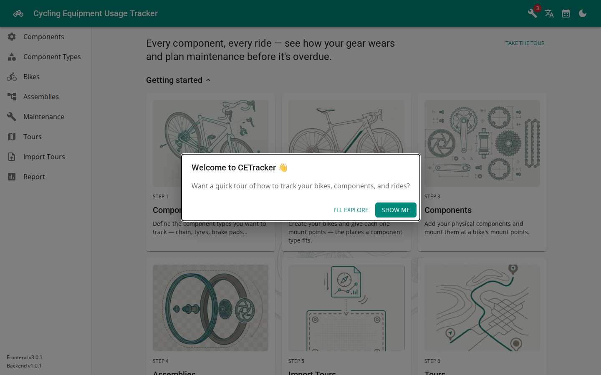

The landing page mirrors this guide's steps as cards, each linking to the right page:

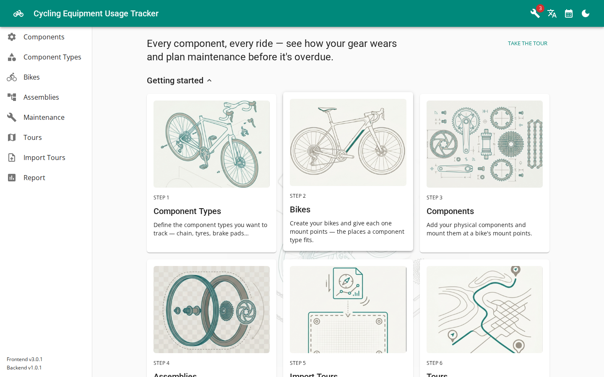

## Step 1 — Define component types

Component types are the kinds of parts you want to track — chain, tires, brake pads, wheels…
Go to **Component Types** and create the ones you care about. You can start small; more types can be added later.

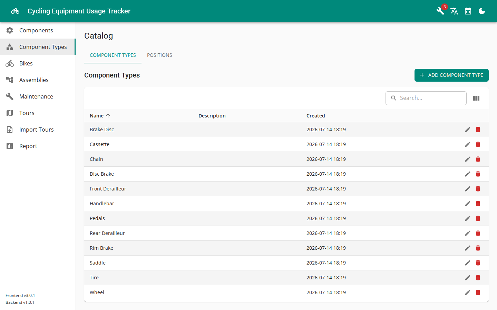

## Step 2 — Create your bikes

Go to **Bikes** and add your bike(s) with the basics: name, manufacturer, model, purchase date.

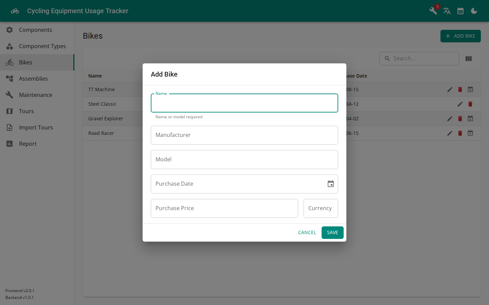

Then open the bike and give it **mount points** — the places a component type fits, e.g. a front and a rear
tire, a chain, front and rear rim brakes. Mount points can be marked *mandatory*: a warning icon shows up
whenever nothing is mounted there.

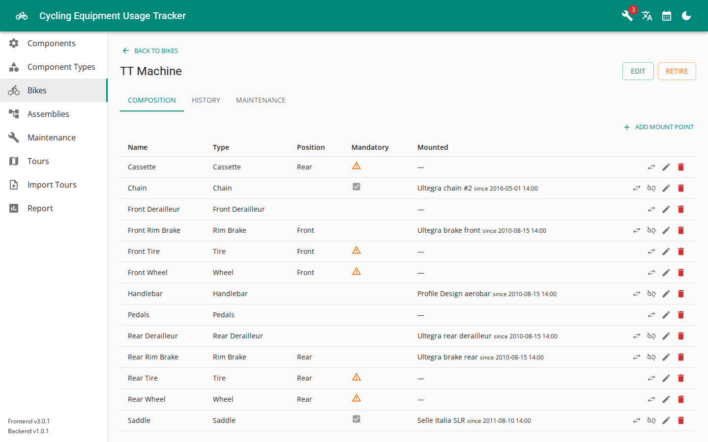

## Step 3 — Add your components

Go to **Components** and register your physical parts — with serial number, purchase date, price and vendor
if you like. Then mount each component at a matching mount point of a bike. From that moment on, every
imported tour adds distance and time to the mounted component.

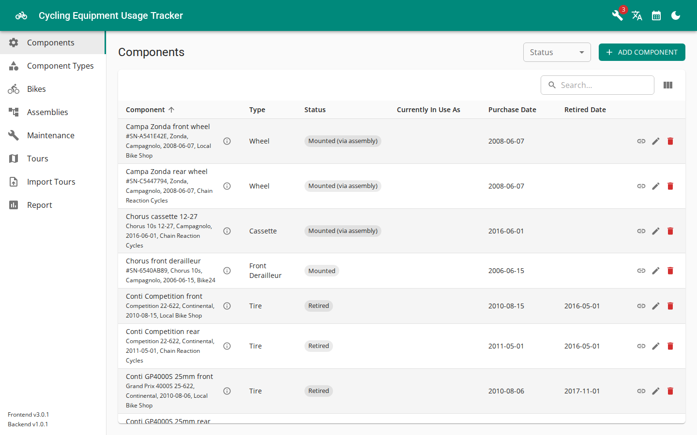

## Step 4 — Group components into assemblies (optional)

If you swap several parts as one unit — the classic example is a wheelset with wheel, tire and cassette —
create an **Assembly** with a slot per component type and place components into its slots. Mounting or
dismounting the assembly then moves all its members together.

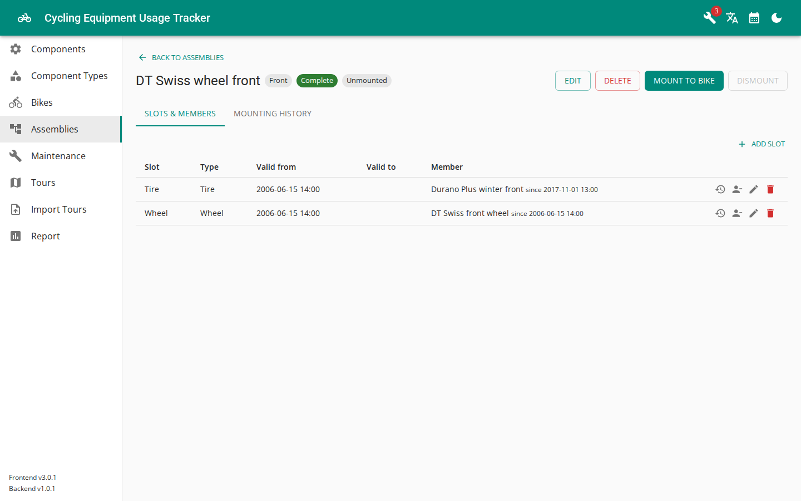

## Step 5 — Import your tours

Go to **Import Tours** and drop a `.fit` file from your bike computer, or a JSON export from MyTourBook.
There is also a direct import from a MyTourBook Derby database. All options are described in detail on the
[Importing Tours](./tour-import.html) page.


## Step 6 — Inspect your tours

The **Tours** page lists everything you have imported, with sums per column and optional grouping by
year, month or bike.

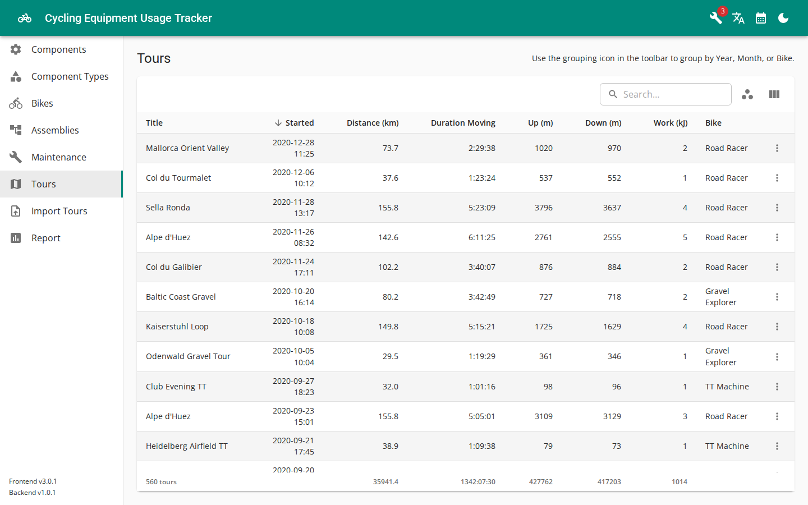

## Step 7 — Set up maintenance tasks

Under **Maintenance** you can define recurring tasks per bike — wax the chain every 300 km, annual service
every 365 days — and log events when they're done. Overdue tasks are flagged in the list and via the
notification icon in the header.

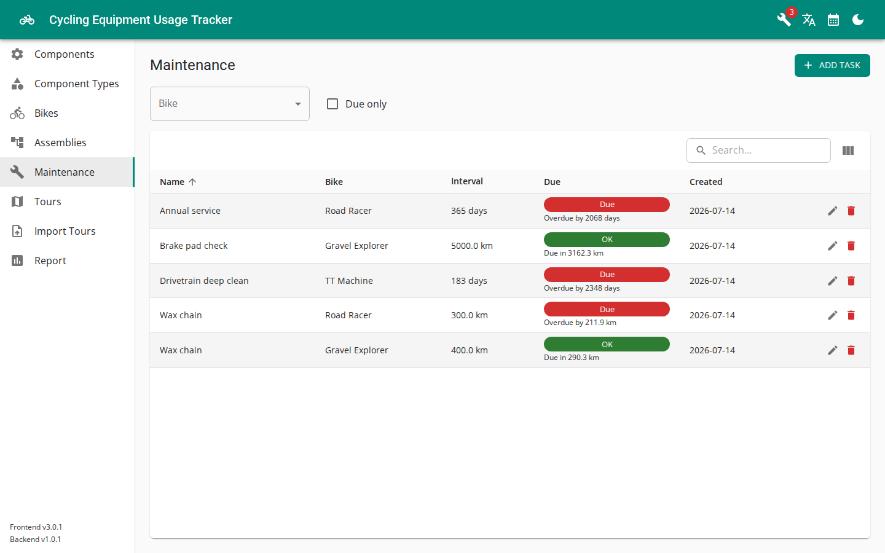

Each task's detail view shows the full history including the distance ridden between events:

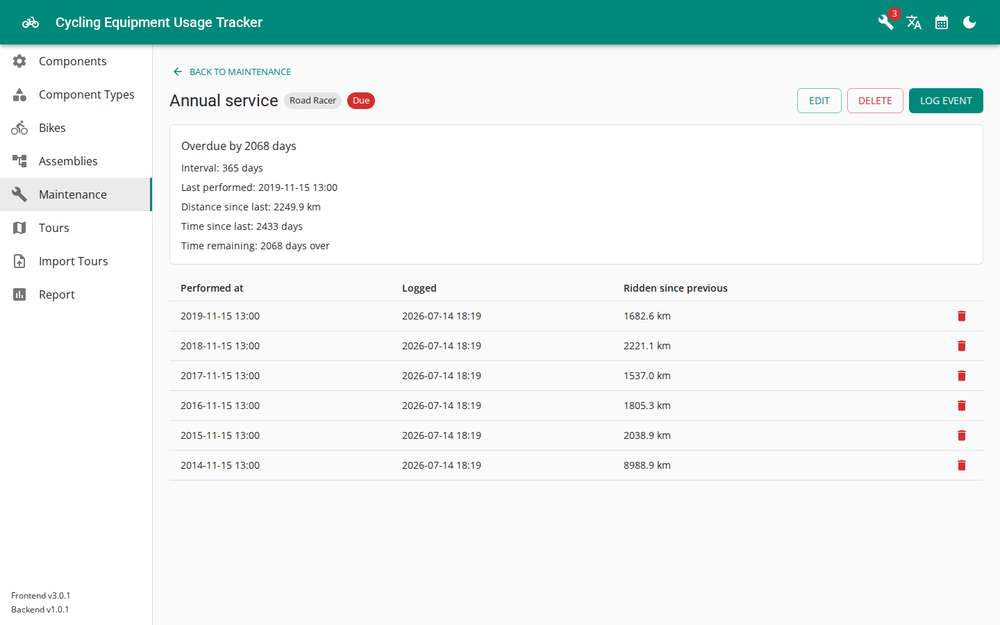

## Step 8 — Enjoy the report

The **Report** page answers the original question: how much use do my components actually get?
Distance, moving time, climbing and work — per component or per bike, filterable to any time range.

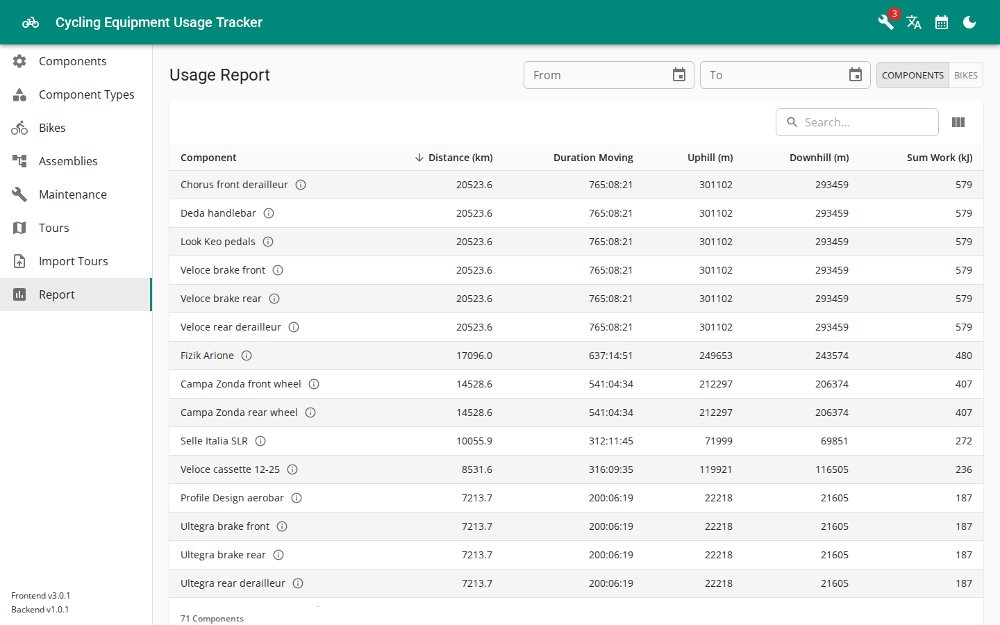

## Bonus — travel back in time

The **History** tab of a bike shows its composition at any past date and the complete mounting history:

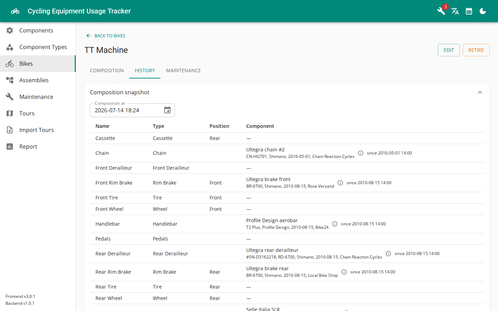
