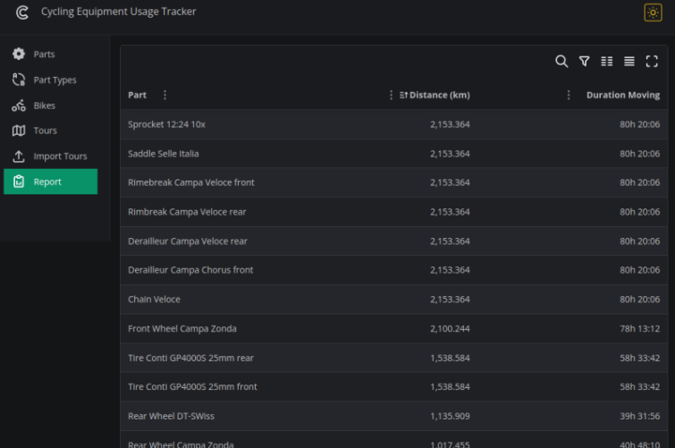

# Cycle Equipment Usage Tracker

## About

If you use one or more bikes extensively, you may have wondered how many miles and hours certain parts of your bike have been in use.
How many miles did the last chain last before it had to be replaced? How many hours did the last brake pads last?

If you've ever asked yourself these questions, CETracker can probably help.

Even more so if you change the parts on your bike frequently. Do you have several sets of wheels that you use depending on the type of tour? If you are prepared to keep track of your bike maintenance with CETracker, the answers to these questions are just a click away.

CETracker is a personal project that came about after I had the issues mentioned above. Since I have been using
[MyTourBook](https://mytourbook.sourceforge.io/) for many year, to keep track of all my tours, I've joined the discussion in suggested feature issue [777](https://github.com/mytourbook/mytourbook/issues/777) about a adding this functionality on the MyTourBook GH project. Basically, this project grew out of the still ongoing discussion.  
Although CETracker is still more or less just a showcase for this suggested feature, it is also usable on its own.

## Prerequisite

- MyTourBook is used for tour statistic
  - Alernativly, the cumbersome work of manually entering the basic details about the completed tours would be possible.
  - Importing tours from exports of well known tour tracking sites is imaginable but it's not on the roadmap.
- Docker-Compose for [cetracker-compose](https://github.com/cetracker/cetracker-compose), Docker or Podman is installed on your local computer. (There are no plans of hosting CETracker anywhere.)
  - Alternativly you could build and run the [cetracker-backend](https://github.com/cetracker/cetracker-backend) (Kotlin - Java 17)  and the [cetracker-frontend](https://github.com/cetracker/cetracker-frontend) (npm/yarn - vite - React). There are detailed building instructions on the each sub project's repository.
- A rudimentary basic understaning of SQL to export the data from the MyTourBook Derby database. See [Data Export Documentation](./data-export.md) for instructions.

## Known Limitations

Currently, there are some known limitations and places that still need to be tweaked and could do with quite bit of polishing. It is, after all, a showcase or a MVP only.

- Error handling needs to be improved in quite a few places!
  - Error status codes aren't reported to the user properly.
- User input validation needs to be extended quite a bit.
- Imported tours can't be modified or deleted via the UI.
- There are glitches in the UI.
- It's being tested (more or less thouroughly) for tracking one single bike only. Some superficial tests with dummy data for a second bike were carried out, though.
- No multi user support, let alone with with data separated from each other (currently not planned either).
- A basic report is generated only. Time range can't be selected. No filtering, grouping is supported currently.

[The source for this GH-Page:](https://cetracker.github.io) [is in this repo](https://github.com/cetracker/cetracker.github.io.git)
