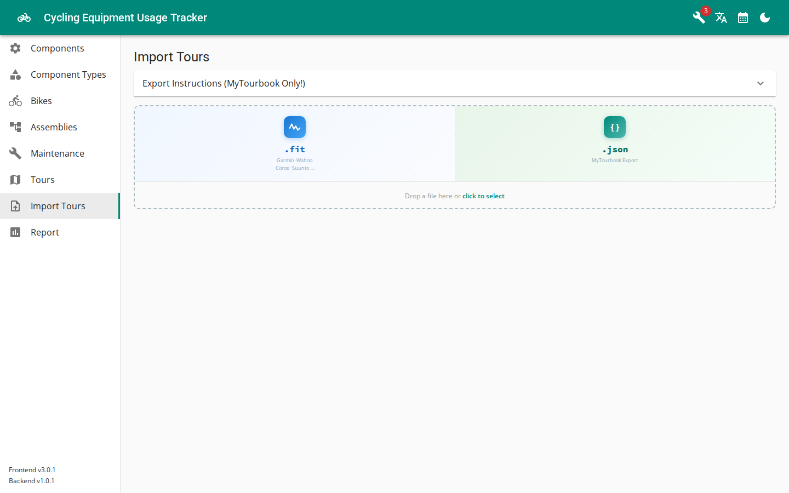
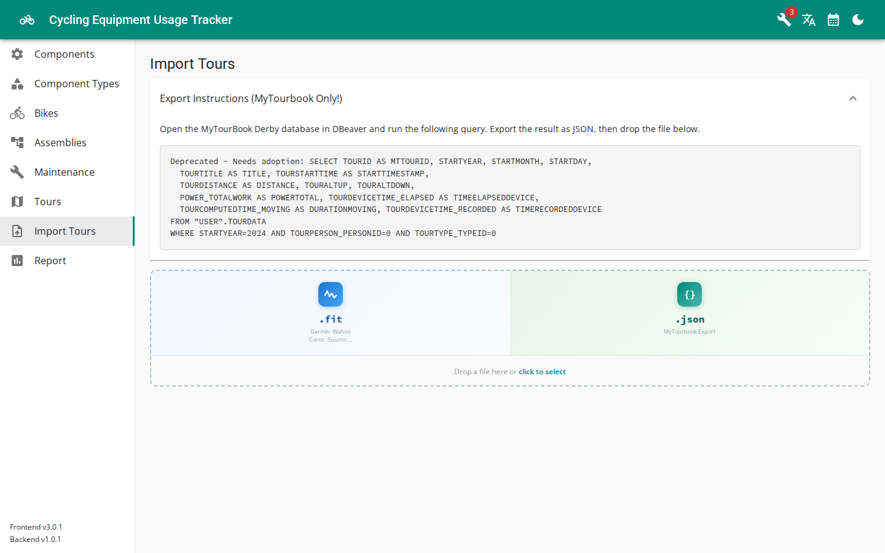

# Importing Tours

CETracker offers three ways to get your tours in. All of them start on the **Import Tours** page —
except the direct MyTourBook database import, which is uploaded via the API and only *reviewed* in the UI.



## Option 1 — FIT files

Drop a `.fit` file recorded by your bike computer or sports watch (Garmin, Wahoo, Coros, Suunto, …)
onto the drop zone. The file is parsed right in the browser; you get a review table of the contained
session(s), pick the bike, and import.

This is the simplest option if you don't use MyTourBook.

## Option 2 — MyTourBook JSON export

If you keep your tours in [MyTourBook](https://mytourbook.sourceforge.io/), you can export them as JSON
from its Derby database and drop that file onto the same drop zone.

Any tool that can run a SQL query against a Derby database and export the result as JSON works —
[DBeaver](https://dbeaver.io/) is a good choice since it supports Derby out of the box. Point it at a
**copy** of your MyTourBook database (on Linux typically `~/.mytourbook/derby-database`) and run:

```sql
SELECT TOURID AS MTTOURID, STARTYEAR, STARTMONTH, STARTDAY,
  TOURTITLE AS TITLE, TOURSTARTTIME AS STARTTIMESTAMP,
  TOURDISTANCE AS DISTANCE, TOURALTUP, TOURALTDOWN,
  POWER_TOTALWORK AS POWERTOTAL, TOURDEVICETIME_ELAPSED AS TIMEELAPSEDDEVICE,
  TOURCOMPUTEDTIME_MOVING AS DURATIONMOVING, TOURDEVICETIME_RECORDED AS TIMERECORDEDDEVICE
FROM "USER".TOURDATA
WHERE STARTYEAR=2026 AND TOURPERSON_PERSONID=0 AND TOURTYPE_TYPEID=0
```

Adjust the `WHERE` clause to your data, export the result as a JSON **array** (in DBeaver: deselect
"Print table name" in the format settings), and upload it. The same instructions are available inside
the app, in the "Export Instructions" panel on the Import Tours page.



Each entry must contain `MTTOURID`, `TITLE`, `DISTANCE`, `DURATIONMOVING`, `TOURALTUP`, `TOURALTDOWN`,
`POWERTOTAL`, `STARTYEAR`, `STARTMONTH`, `STARTDAY` and `STARTTIMESTAMP`. You select the bike the tours
belong to at upload time; alternatively an optional `BIKEID` (a CETracker bike UUID) per entry assigns
bikes from the file.

## Option 3 — Direct MyTourBook database import

Instead of exporting query results you can hand CETracker a compressed copy of the MyTourBook Derby
database and let the backend do the work. It queries the database read-only, figures out which tours are
new, and stages them as an *import session* for review.

Tours are matched to your bikes via MyTourBook **tour tags**: tag each tour in MyTourBook with the UUID
of the CETracker bike it was ridden on (the UUID is visible in the browser's address bar when you open
the bike in CETracker). Only tagged tours are considered.

1. Create a compressed archive of a copy of the database:

   ```bash
   cp -r ~/.mytourbook/derby-database /tmp/
   cd /tmp && zip -r tourbook.zip derby-database
   ```

2. Upload it to the backend (adjust host/port to your setup):

   ```bash
   curl -X POST --data-binary @tourbook.zip \
     -H "Content-Type: application/octet-stream" \
     http://localhost:9000/api/tours/mytourbook/import-sessions
   ```

3. If the archive yields new tours or warnings, a pending import session is created and the wrench icon
   in CETracker's header signals that an import awaits review. Open **Import review**, check the
   candidate tours, resolve any warnings (e.g. a tour tagged with more than one bike), and commit the
   ones you want.

If the archive contains nothing new, no session is created (the upload answers `204 No Content`).

By default tours of MyTourBook person `0` and a preset list of tour types are considered; both are
configurable via the backend properties `app.mytourbook.tour-person-id` and `app.mytourbook.tour-type-ids`.
